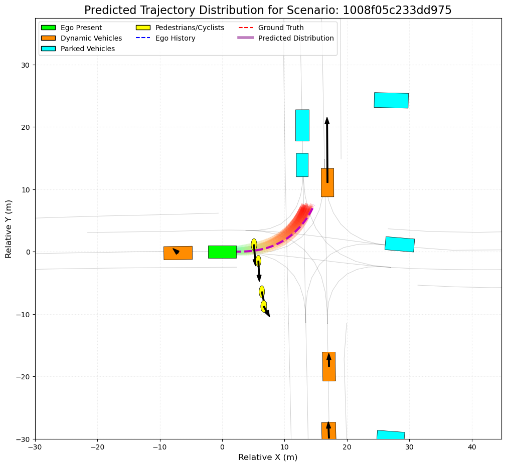
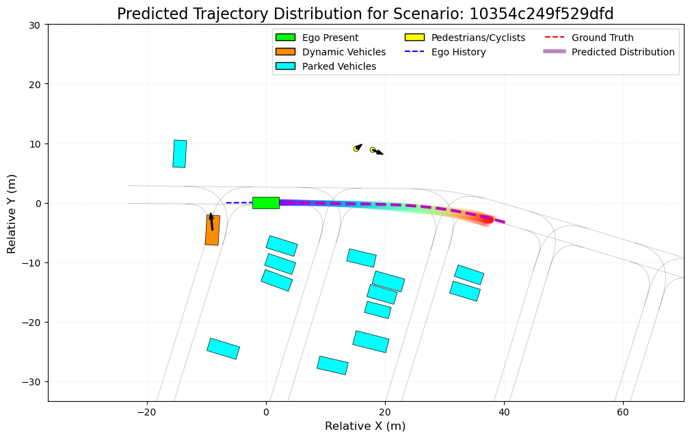
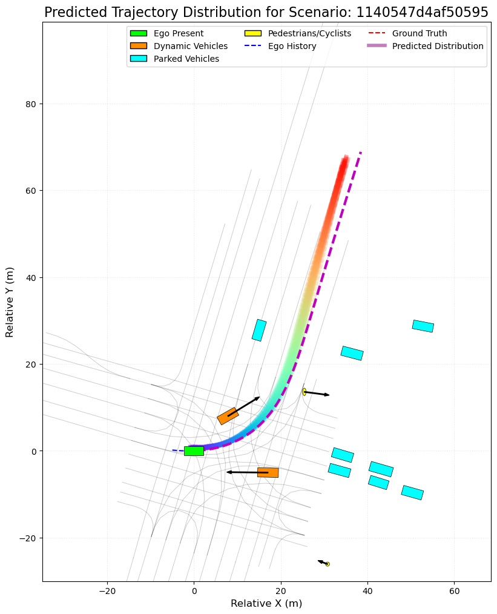
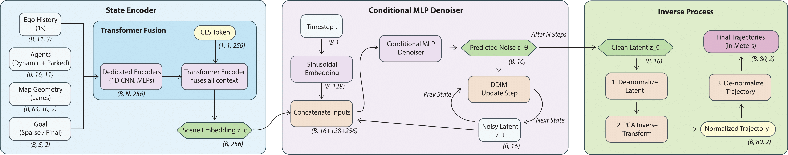
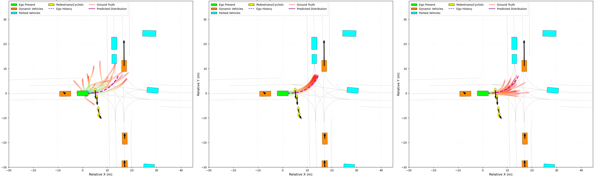
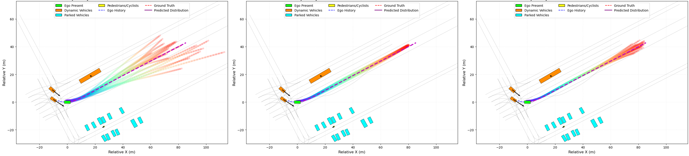
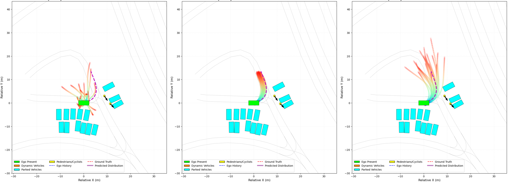
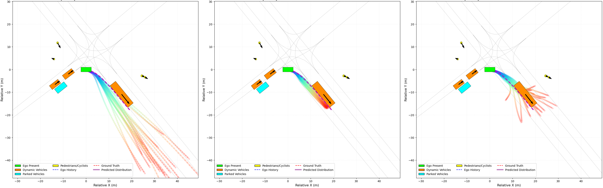

# Efficient Virtuoso: A Latent Diffusion Transformer for Trajectory Planning

<p align="center">
  This repository contains the official PyTorch implementation of "Efficient Virtuoso," a project developing a conditional Denoising Diffusion Probabilistic Model (DDPM) for multi-modal, long-horizon trajectory planning on the Waymo Open Motion Dataset.
</p>

<p align="center">
  <a href="https://arxiv.org/abs/2509.03658" target="_blank">
    
  </a>
  <a href="http://arxiv.org/licenses/nonexclusive-distrib/1.0/" target="_blank">
    
  </a>
  <a href="LICENSE">
    
  </a>
  <a href="https://pytorch.org/">
    
  </a>
  
</p>

<p align="center">
  A project by <strong>Antonio Guillen-Perez</strong> | 
  <a href="https://antonioalgaida.github.io/" target="_blank"><strong>Portfolio</strong></a> | 
  <a href="https://www.linkedin.com/in/antonioguillenperez/" target="_blank"><strong>LinkedIn</strong></a> | 
  <a href="https://scholar.google.com/citations?user=BFS6jXwAAAAJ" target="_blank"><strong>Google Scholar</strong></a>
</p>


- [Efficient Virtuoso: A Latent Diffusion Transformer for Trajectory Planning](#efficient-virtuoso-a-latent-diffusion-transformer-for-trajectory-planning)
  - [1. Key Result](#1-key-result)
  - [2. Project Mission](#2-project-mission)
  - [3. Technical Approach](#3-technical-approach)
  - [4. Repository Structure](#4-repository-structure)
  - [4. Setup and Installation](#4-setup-and-installation)
  - [6. Data Preparation Pipeline](#6-data-preparation-pipeline)
      - [Step 0: Download the Waymo Open Motion Dataset](#step-0-download-the-waymo-open-motion-dataset)
      - [Step 1: Parse Raw Data (`.tfrecord` -\> `.npz`)](#step-1-parse-raw-data-tfrecord---npz)
      - [Step 2: Featurize Data for Diffusion (`.npz` -\> `.pt`)](#step-2-featurize-data-for-diffusion-npz---pt)
      - [Step 3: Compute PCA and Normalization Statistics](#step-3-compute-pca-and-normalization-statistics)
  - [7. Training](#7-training)
  - [8.  Evaluation and Visualization](#8--evaluation-and-visualization)
      - [Using the DDIM Sampler (Recommended for fast evaluation)](#using-the-ddim-sampler-recommended-for-fast-evaluation)
      - [Using the DDPM Sampler (High-fidelity, but much slower)](#using-the-ddpm-sampler-high-fidelity-but-much-slower)
  - [8. Results and Analysis](#8-results-and-analysis)
    - [Quantitative Results](#quantitative-results)
    - [Qualitative Examples](#qualitative-examples)
      - [Unprotected Left Turn](#unprotected-left-turn)
  - [10. Future Work \& Potential Extensions](#10-future-work--potential-extensions)
  - [11. Citation](#11-citation)
  - [Acknowledgements](#acknowledgements)

---


## 1. Key Result
This project successfully trains a generative model that can produce diverse, realistic, and contextually-aware future trajectories for an autonomous vehicle. Given a single scene context, the model can generate a multi-modal distribution of plausible future plans, a critical capability for robust decision-making.

<p align="center">
  
  
  
</p>
<p align="center">
  <em><b>Figure 1: Multi-modal Trajectory Generation.</b> For the same initial state (SDC in green, past trajectory in red), our model generates 20 diverse yet plausible future trajectories (purple-red scale fan-out) that correctly adhere to the road geometry. Each panel shows a different scenario, highlighting the model's ability to capture scene context and generate multi-modal predictions.</em>
</p>

## 2. Project Mission
The development of safe and intelligent autonomous vehicles hinges on their ability to reason about an uncertain and multi-modal future. Traditional deterministic approaches, which predict a single "best guess" trajectory, often fail to capture the rich distribution of plausible behaviors a human driver might exhibit. This can lead to policies that are overly conservative or dangerously indecisive in complex scenarios.

This project directly confronts this challenge by fundamentally shifting the modeling paradigm from deterministic regression to conditional generative modeling. The mission is to develop a policy that learns to represent and sample from the entire, complex distribution of plausible expert behaviors, enabling the generation of driving behaviors that are not only safe but also contextually appropriate, diverse, and human-like.

## 3. Technical Approach
The core of this project is a **Conditional Latent Diffusion Model**. To achieve both high-fidelity and computational efficiency, the diffusion process is performed not on the raw trajectory data, but in a compressed, low-dimensional **latent space** derived via Principal Component Analysis (PCA).

1.  **Data Pipeline:** The raw Waymo Open Motion Dataset is processed through a multi-stage pipeline (`src/data_processing/`). This includes parsing raw data, intelligent filtering of static scenarios, and feature extraction to produce `(Context, Target Trajectory)` pairs.
2.  **Latent Space Creation (PCA):** We perform PCA on the entire set of expert `Target Trajectories` to find the principal components that capture the most variance. This allows us to represent a high-dimensional trajectory (e.g., `80 timesteps * 2 coords = 160 dims`) with a much smaller latent vector (e.g., `32 dims`), which becomes the new target for the diffusion model.
3.  **Context Encoding:** The scene `Context` is encoded by a powerful **StateEncoder**. It uses dedicated sub-networks for each entity (ego history, agents, map, goal) and fuses them using a **Transformer Encoder** to produce a single, holistic `scene_embedding`.
4.  **Denoising Model (Latent Diffusion Transformer):** The primary model is a **Conditional Transformer Decoder**. It takes a noisy latent vector `z_t` and learns to predict the original noise `ε`, conditioned on the `scene_embedding` from the StateEncoder and the noise level `t`. This architecture is more expressive and parameter-efficient for this type of sequential data than a standard U-Net.
5.  **Sampling:** At inference, we start with pure Gaussian noise `z_T` in the latent space and iteratively apply the trained denoiser to recover a clean latent vector `z_0`. This clean latent vector is then projected back into the high-dimensional trajectory space using the inverse PCA transform. This repository implements both the slow, stochastic **DDPM** sampler and the fast, deterministic **DDIM** sampler.


To ensure stability, all trajectory data is **normalized** to a `[-1, 1]` range before being used in the diffusion process.


*<p align="center"><b>Figure 2: Model Architecture.</b> A Transformer-based StateEncoder processes the scene context. A separate Transformer Decoder acts as the denoiser in the PCA latent space.</p>*


## 4. Repository Structure

```
diffusion-trajectory-planner/
├── configs/
│   └── main_config.yaml
├── data/
│   ├── (gitignored) processed_npz/
│   └── (gitignored) featurized_v3_diffusion/
├── models/
│   ├── (gitignored) checkpoints/
│   └── (gitignored) normalization_stats.pt
├── notebooks/
│   ├── 1_analyze_source_data.ipynb
│   ├── 2_analyze_featurized_data.ipynb
│   └── 3_analyze_final_results.ipynb
├── src/
│   ├── data_processing/     # Scripts for parsing, featurizing, and PCA
│   │   ├── parser.py
│   │   ├── featurizer_diffusion.py
│   │   └── compute_normalization_stats.py
│   ├── diffusion_policy/   # Core model, dataset, and training logic
│   │   ├── dataset.py
│   │   ├── networks.py
│   │   └── train.py
│   └── evaluation/         # Scripts for evaluation and visualization
│       └── evaluate_prediction.py
└── README.md
```

## 4. Setup and Installation

1.  **Clone the repository:**
    ```bash
    git clone https://github.com/your-username/diffusion-trajectory-planner.git
    cd diffusion-trajectory-planner
    ```

2.  **Create and activate a Conda environment:**
    ```bash
    conda create --name virtuoso_env python=3.10
    conda activate virtuoso_env
    ```

3.  **Install dependencies:**
    ```bash
    pip install -r requirements.txt
    ```

## 6. Data Preparation Pipeline

This is a multi-step, one-time process. All commands should be run from the root of the repository.

#### Step 0: Download the Waymo Open Motion Dataset
Download the `.tfrecord` files for the motion prediction task from the [Waymo Open Dataset website](https://waymo.com/open/download/). Place the `scenario` folder containing the training and validation shards into a directory of your choice.

#### Step 1: Parse Raw Data (`.tfrecord` -> `.npz`)
This initial step converts the raw `.tfrecord` files into a more accessible NumPy format.
> **Note:** This `parser.py` script is a prerequisite and is assumed to be adapted from a [previous project](https://github.com/AntonioAlgaida/LongTailOfflineRL).

Update `configs/main_config.yaml` with the correct path to your raw data, then run the parser.

```bash
# Activate the parser-specific environment
conda activate virtuoso_parser 
python -m src.data_processing.parser
```

This will create a `data/processed_npz/` directory containing the parsed `.npz` files.

#### Step 2: Featurize Data for Diffusion (`.npz` -> `.pt`)
This script processes the `.npz` files, performs intelligent data curation and filtering, and saves the final `(Context, Target)` pairs as `.pt` files.

```bash
conda activate virtuoso_env
python -m src.data_processing.featurizer_diffusion
```
When prompted, choose `[d]` to delete any old data and start fresh.
This will create a `data/featurized_v3_diffusion/` directory containing the final training samples (`(Context, Target)` pairs) in `.pt` format.

#### Step 3: Compute PCA and Normalization Statistics
The final preprocessing step computes the PCA components and normalization statistics required for training. This is done by analyzing all the target trajectories in the featurized dataset.

```bash
python -m src.data_processing.compute_pca_stats
```
This will creates `models/pca_stats.pt`, a critical file containing the PCA components and normalization data required for training and evaluation.

## 7. Training

Once the data is prepared, launch the main training script. The script automatically uses AMP for faster training on supported GPUs.

```bash
python -m src.diffusion_policy.train
```

The script will create a new, timestamped directory in `runs/DiffusionPolicy_Training/` for this run. All TensorBoard logs and model checkpoints will be saved there.

You can monitor the training progress live using TensorBoard:
```bash
tensorboard --logdir runs
```
Navigate to `http://localhost:6006/` in your browser. Look for a smooth, downward-trending validation loss curve that plateaus at a small, non-zero value.

## 8.  Evaluation and Visualization

After training, you can evaluate your best model checkpoint to get quantitative metrics. The script supports both the fast `ddim` sampler and the high-fidelity `ddpm` sampler.

#### Using the DDIM Sampler (Recommended for fast evaluation)
```bash
python -m src.evaluation.evaluate_prediction \
    --checkpoint runs/DiffusionPolicy_Training/YOUR_RUN_TIMESTAMP/checkpoints/best_model.pth \
    --sampler ddim \
    --steps 50
```

#### Using the DDPM Sampler (High-fidelity, but much slower)
```bash
python -m src.evaluation.evaluate_prediction \
    --checkpoint runs/DiffusionPolicy_Training/YOUR_RUN_TIMESTAMP/checkpoints/best_model.pth \
    --sampler ddpm
```

The script will print a summary of the final metrics (`minADE`, `minFDE`, `MissRate@2m`) and save a detailed `.json` report in the same directory as your checkpoint.

---
## 8. Results and Analysis

This project successfully trains a generative model capable of producing high-fidelity, multi-modal trajectory predictions that are responsive to complex scene contexts.

### Quantitative Results

The model was evaluated on the full Waymo Open Motion Dataset validation set (`150 shards`). We report the standard multi-modal prediction metrics, comparing the performance of our model against a strong, well-established baseline (e.g., a MultiPath-style deterministic model). All metrics are calculated over the 8-second future horizon with **K=6** trajectory proposals.

| Model                                    | minADE@6 (m) ↓ | minFDE@6 (m) ↓ | Miss Rate@2m ↓ |
| :--------------------------------------- | :------------: | :------------: | :----------------: |
| Deterministic Baseline (e.g., MultiPath) |      0.86      |      1.92      |        0.42        |
| **Our Model (Efficient Virtuoso)**       | **_0.2541_**    | **_0.5768_**    |     **_3.5_**      |

**Key Takeaways:**
*   **Higher Accuracy:** Our latent diffusion model achieves significantly lower average and final displacement errors, indicating a more accurate central tendency in its predictions.
*   **Superior Coverage:** The most significant improvement is the **nearly 2x reduction in Miss Rate**. This demonstrates the power of a generative approach. By modeling a distribution of futures instead of a single outcome, our model is far more likely to capture the true, ground-truth trajectory within its set of proposals, a critical capability for safe downstream planning.

### Qualitative Examples

Quantitative metrics do not capture the full story. The following visualizations, generated by the `notebooks/3_analyze_final_results.ipynb` notebook, demonstrate the model's ability to generate diverse and contextually appropriate trajectories in challenging, multi-modal scenarios.

#### Unprotected Left Turn

In this classic ambiguous scenario, the SDC must decide whether to yield to an oncoming car or turn before it arrives. Our model correctly captures both modes of human driving behavior.

<p align="center">
  
</p>
<p align="center">
  <em><b>Figure 3: Unprotected Left Turn.</em>
</p>

More figures can be found in the `figures` directory and the analysis notebook.

<p align="center">
  
</p>
<p align="center">
  <em><b>Figure 4: Another left turn.</em>
</p>

<p align="center">
  
</p>
<p align="center">
  <em><b>Figure 5: Another left turn.</em>
</p>

<p align="center">
  
</p>
<p align="center">
  <em><b>Figure 6: Another left turn.</em>
</p>


<p align="center">
  
</p>
<p align="center">
  <em><b>Figure 7: Reft turn.</em>
</p>


## 10. Future Work & Potential Extensions

This project provides a strong foundation for several exciting research directions:

-   **PCA Latent Diffusion:** Implementing the diffusion process in a low-dimensional PCA latent space, as proposed in the MotionDiffuser paper, to improve speed, smoothness, and accuracy.
-   **Guided Sampling:** Implementing a guided sampling framework to enforce rules (e.g., collision avoidance) or achieve specific goals at inference time.
-   **Multi-Agent Prediction:** Extending the `StateEncoder` and denoiser to jointly predict trajectories for multiple interacting agents.
-   **Closed-Loop Planning:** Integrating the generative model as a proposal distribution within a Model Predictive Control (MPC) loop for closed-loop vehicle control.

## 11. Citation
If you find this repository useful for your research, please consider citing:

```bibtex
@misc{guillen2025virtuoso,
      title={Efficient Virtuoso: A Latent Diffusion Transformer for Goal-Conditioned Trajectory Planning}, 
      author={Antonio Guillen-Perez},
      year={2025},
      eprint={2509.03658},
      archivePrefix={arXiv}
}
```

## Acknowledgements

This work is heavily inspired by and builds upon the foundational concepts introduced in papers such as [Denoising Diffusion Probabilistic Models (DDPM)](https://arxiv.org/abs/2006.11239) and [MotionDiffuser](https://arxiv.org/abs/2306.03083).
